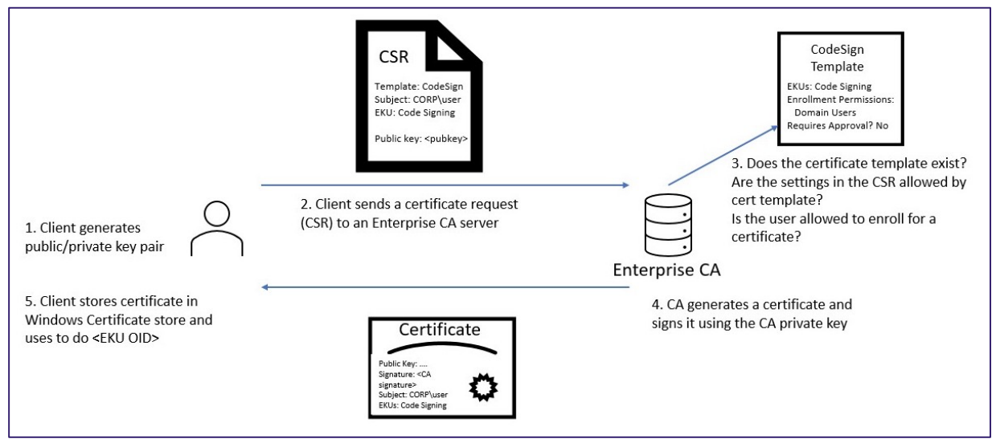

# Cryptography

### Digital Certificate

A digital certificate, also known simply as a certificate, is a digital document that serves as a means of **identity verification** in the context of a Public Key Infrastructure (PKI).

Key elements includes:

- **Certificate Holder (Subject)**: The subject of a digital certificate is the entity (person, organization, server, device, etc.) to which the certificate is issued.
- **Public Key**: This key is mathematically related to the subject's private key and is used for encryption, digital signatures, and other cryptographic operations.
- **Issuer (Certificate Authority)**: The issuer of a digital certificate is the Certificate Authority (CA) that verifies the identity of the subject and issues the certificate. 
- **Digital Signature**: The issuer's digital signature is a cryptographic hash value generated using the issuer's private key. This signature ensures the integrity of the certificate's content. 
- **Certificate Serial Number**: Each certificate is assigned a unique serial number by the issuing CA. 
- **Validity Period**: A digital certificate is valid for a specified period of time.
- **Certificate Chains and Trust**: Digital certificates are often organized in a hierarchy, with a Root CA at the top issuing certificates to Intermediate CAs, which in turn issue certificates to end entities (subjects). 
- **SubjectAlternativeName**
- **Basic Constraints**
- **Extended Key Usages (EKUs)**: Object identifiers (OIDs) that describe how the certificate
will be used.:
  - *Code Signing*: The certificate is for signing executable code
  - *Encrypting File System*: The certificate is for encrypting file systems
  - *Secure Email*: The certificate is for encrypting email
  - *Client Authentication*: The certificate is for authentication to another server (e.g., to AD)
  - *Smart Card Logon*: The certificate is for use in smart card authentication.
  - *Server Authentication*: The certificate is for identifying servers
- **Certificate Attributes**: A digital certificate contains various attributes that provide additional information about the certificate, such as its intended usage (e.g., encryption, digital signatures)

#### Public/Private key pair

private key and associated public key are mathematically related to one another. The public key can be shared widely. The private key proves ownership of the identity and must be kept secret.

##### Private Keys

##### Public Keys

#### Subject Alternative Names

A Subject Alternative Name (SAN) is an extension within a certificate that allows the certificate holder to specify additional domain names, IP addresses, or other identifiers for which the certificate should be considered valid.
In other words, a single TLS certificate with multiple SAN entries can secure multiple domain names or IP addresses, allowing them to be used in the same SSL/TLS session without the need for separate certificates.

However, it is important to know that by default, during certificate-based authentication, one way AD maps certificates to user accounts based on a UPN specified in the SAN
This means that if an attacker can specify an arbitrary SAN when requesting a certificate that has an EKU
enabling client authentication, and the CA creates and signs a certificate using the attackersupplied SAN, **the attacker can become any user in the domain**

#### Risky EKUs

The following EKUs allows authentication:

- *Client Authentication* 1.3.6.1.5.5.7.3.2
- *PKINIT Client Authentication* 1.3.6.1.5.2.3.4
- *Smart Card Logon* 1.3.6.1.4.1.311.20.2.2
- *Any Purpose* 2.5.29.37.0
- *SubCA (no EKUs)*

The "Certificate Request Agent" Enhanced Key Usage (EKU) is a specific purpose that can be assigned to a digital certificate.

Here are the risks of this EKU:

- **Privilege Escalation**: If not properly controlled, a certificate with the "Certificate Request Agent" EKU might be used to escalate privileges, as it allows the certificate holder to request certificates that might grant access or permissions beyond what is intended (ESC3)

The "Enrollable Any Purpose" Enhanced Key Usage (EKU) is a special extension that can be included in a digital certificate to indicate that the certificate can be used for any purpose for which a certificate is typically used.

##### Side Note: PKINIT

PKINIT is a preauthentication mechanism for Kerberos 5 which uses X.509 certificates to authenticate the KDC to clients and vice versa.

#### Validation levels

##### Domain Validation *(DV)*

Domain Validation certificates are the **most basic** type of SSL certificates. The validation process involves verifying that the entity requesting the certificate **has control over the domain** for which the certificate is being issued.

##### Organization Validation *(OV)*

In addition to verifying domain control, the CA also validates the identity and existence of the organization requesting the certificate. The verification process includes checks against official government records and business directories to confirm the organization's legitimacy.

##### Extended Validation *(OV)*

EV certificates can be issued only by a subset of certificate authorities (CAs) and require verification of the requesting **entity's legal identity** before certificate issuance.

#### Certificate Revocation List *(CRL)*

A list of revoked public key certificates created and digitally signed by a Certification Authority

*Note that this list doesn’t include expired certificates.*

### SSL/TLS

Transport Layer Security (TLS) is a cryptographic protocol designed to provide communications security over a computer network.

|Protocol|Published|
|-|-|
|SSL 1.0|Unpublished|
|SSL 2.0|1995|
|SSL 3.0|1996|
|TLS 1.0|1999|
|SSL 1.1|2006|
|SSL 1.2|2008|
|SSL 1.3|2018|

#### Versions

##### SSL 1.0

- SSL 1.0 was the first attempt at creating a secure communication protocol by Netscape in the early 1990s.
- It had significant security flaws and vulnerabilities, and it was never released to the public due to these weaknesses.
- SSL 1.0 was quickly replaced by SSL 2.0.

##### SSL 2.0

- SSL 2.0 was released by Netscape and was the first widely adopted secure communication protocol for web browsers.
- Introduced the concept of secure sessions and encryption of data transmitted between a client and a server.
- SSL 2.0 had several security vulnerabilities and weaknesses, including issues with key exchange and encryption algorithms.

##### SSL 3.0

SSL 1.0 and SSL 2.0 were short-lived due to significant security flaws, and they quickly fell out of use.

- Addressed many of the security vulnerabilities in SSL 2.0 and introduced several cryptographic enhancements.
- Introduced the concept of "record" protocol and "block" cipher suites, making it more efficient and secure.
- Despite improvements, SSL 3.0 was also found to have vulnerabilities, leading to its eventual replacement.

SSL 3.0 was widely adopted for a time, but it too suffered from vulnerabilities, including the well-known POODLE attack (Padding Oracle On Downgraded Legacy Encryption).

##### TLS 1.0

- Introduced several improvements, including stronger message authentication and key exchange methods.
- Vulnerabilities and attacks against SSL/TLS protocols (such as BEAST and POODLE) led to the eventual deprecation of TLS 1.0.

##### TLS 1.1

- Introduced support for new cipher suites and added protection against cipher suite negotiation attacks.
- TLS 1.1 is also considered vulnerable to certain attacks and is now considered outdated.

##### TLS 1.2

- TLS 1.2 introduced significant security improvements and cryptographic enhancements over its predecessors.
  - Added protection against cipher-block chaining (CBC) attacks
- TLS 1.2 improved resistance against attacks such as BEAST and provided better protection against data leakage
- It is widely supported and considered the minimum recommended version for secure communication.

##### TLS 1.3

- TLS 1.3 is the latest version of the TLS protocol, designed with a focus on security, performance, and modern cryptographic practices.
- Removes older, less secure cryptographic algorithms and deprecated weaker cipher suites.
- Introduces significant performance improvements by reducing the number of round-trips required during the handshake process.
- TLS 1.3 is widely recommended for modern applications due to its strong security and performance features.

### Cipher Suites

Each cipher suite has a unique name that is used to identify it and to describe the algorithmic contents of it.
An example of a cipher suite name: **TLS_ECDHE_RSA_WITH_AES_128_GCM_SHA256**

- **TLS**: Defines the protocol that this cipher suite is for; it will usually be TLS.
- **ECDHE**: Indicates the key exchange algorithm being used.
- **RSA**: Authentication mechanism during the handshake.
- **AES**: Session cipher.
- **128**: Session encryption key size (bits) for cipher.
- **GCM**: Type of encryption (cipher-block dependency and additional options).
- **SHA**: Indicates the message authentication algorithm which is used to authenticate a message.
- **256**: Digest size (bits).

#### Key Exchange Algorithm

Is a method by which cryptographic keys are exchanged between two parties, allowing use of a cryptographic algorithm.

##### Diffie-Hellman Key Exchange *(1976)*

This groundbreaking method allows two parties to securely agree on a shared secret key over an insecure channel without needing to exchange the actual key itself. The security relies on the mathematical properties of modular exponentiation and the difficulty of the discrete logarithm problem.

##### RSA Key Exchange *(1977)*

The RSA algorithm, invented by Ron Rivest, Adi Shamir, and Leonard Adleman in 1977, introduced the concept of public-key encryption and digital signatures. While RSA can be used for key exchange, **it's more commonly employed for secure communication and authentication**.

#### Elliptic Curve Cryptography (ECC) Key Exchange *(1985-Present)*

ECC-based key exchange, such as Elliptic Curve Diffie-Hellman (ECDH), has gained popularity due to its efficiency and security, making it suitable for resource-constrained devices and high-security environments.

#### Side Note: Perfect Forward Secrecy *(PFS)*

Perfect Forward Secrecy is a property in cryptography and communication protocols that ensures that the compromise of a long-term secret key (such as an encryption key) does not compromise the confidentiality of past or future communications.

PFS is achieved by using temporary, **ephemeral keys** that are generated for each communication session.

### Authentication

|Code|Name|Status|
|-|-|-|
|DSS|Digital Signature Standard|Recommended|

#### Digital Signature Standard

@TO DO

### Encryption


|Code|Name|Status|
|-|-|-|
|AES 128 CCM|Advanced Encryption Standard with 128bit key in Counter with CBC-MAC|Secure|
|AES 128 CCM 8|Advanced Encryption Standard with 128bit key in Counter with CBC-MAC mode with 8-Octet ICV*|Recommended|
|ARIA 256 CBC|ARIA with 256bit key in Cipher Block Chaining mode|Vulnerable to CBC mode attacks|
|CAMELLIA 256 CBC|CAMELLIA with 256bit key in Cipher Block Chaining mode|Vulnerable to CBC mode attacks|
|CAMELLIA 128 GCM|CAMELLIA with 128bit key in Galois/Counter mode|Recommended|
|CHACHA20 POLY1305|ChaCha stream cipher and Poly1305 authenticator|Recommended|

### Comparaison of common encryption 

- The block size determines the size of data that the algorithm processes in a single operation.
- The key length determines the length of the cryptographic key used for encryption and decryption.
- The number of rounds indicates how many iterations of specific operations the algorithm performs to achieve its encryption or decryption process.

|Name|Block Size|Key Length|Rounds|
|-|-|-|-|
|Triple-DES|64 bits|168 bits|48 rounds|
|RC4|*Not applicable (stream cipher)*|40 to 2048 bits|*Not applicable (stream cipher)*|
|Blowfish|64 bits|32 bits to 448 bits|16|
|Twofish|128 bits|128, 192, or 256 bits|- 16 rounds for 128-bit keys<br>- 16 rounds for 192-bit keys<br>- 20 rounds for 256-bit keys<br>|
|ChaCha20|512 bits|128 or 256 bits|20 rounds (for the 256-bit key version)|
|AES|128 bits|128, 192, or 256 bits|- 10 rounds for 128-bit keys<br>- 12 rounds for 192-bit keys<br>- 14 rounds for 256-bit keys<br>

#### Triple-DES *(3DES)*

Triple DES is a variant of the Data Encryption Standard (DES) that applies the DES algorithm three times in succession

- While it's more secure than single DES, it's considered slower and less efficient compared to AES.
- It is widely supported and compatible with legacy systems.

#### RC4

RC4 is a stream cipher

- Highly vulnerable to statistical attacks and biases.
- Prone to serious vulnerabilities, leading to its deprecation in modern protocols.

##### Stream Ciphers

A stream cipher is a type of encryption algorithm that operates on individual bits or bytes of data, encrypting and decrypting data one bit or byte at a time.

- Stream ciphers are suitable for applications that require low latency, such as real-time communication and streaming media, where delays caused by block cipher processing might be less desirable.
- The nature of stream ciphers allows for easier parallel processing, which can improve performance on systems with multiple processing units.
- Stream ciphers may be more susceptible to certain types of attacks, such as known-plaintext attacks, if not designed and implemented carefully.
- The security of a stream cipher relies heavily on the strength and unpredictability of its key stream generator. 

#### Blowfish

- Fast and efficient encryption.
- No known vulnerabilities in the core algorithm, however, relatively small block size (64 bits) can make it susceptible to birthday attacks.
- Some concerns about its security as cryptanalysis advances.

#### Twofish

- Strong security design and resistance to known attacks.

#### ChaCha20

- Fast and secure, suitable for high-performance applications.
- Well-suited for devices with limited computational resources.
- May have slightly different security assumptions compared to traditional block ciphers.

#### AES

AES is a variant of Rijndael, with a fixed block size of 128 bits, and a key size of 128, 192, or 256 bits

#### Counter

The "Counter" is a fundamental component used in various modes of operation for block ciphers.

- Encryption parallelizable means that encryption operations for different blocks can be done simultaneously.
- Decryption parallelizable means that decryption operations for different blocks can be done simultaneously.
- Random read access means that the ciphertext blocks can be decrypted in any order without needing to process previous blocks first.
 
|Mode|Encryption parallelizable|Decryption parallelizable|Random read access|
|-|-|-|-|
|CBC|No|Yes|Yes|
|CTR|Yes|Yes|Yes|
|GCM|Yes|Yes|Yes|

##### Cipher Block Chaining *(CBC)*

- CBC is a classic mode of operation that involves chaining the output of the previous block's encryption to the input of the current block's encryption.

**While CBC mode is widely used, it has been associated with security vulnerabilities, particularly padding oracle attacks. As a result, modern cryptographic standards and protocols have been moving towards modes that provide both encryption and authentication, such as Galois/Counter Mode (GCM) or other authenticated encryption modes.**

##### Counter Mode *(CTR)*

- CTR mode is highly popular due to its simplicity and efficiency.
- It is widely used for:
  - Disk encryption
  - Secure communication protocols (such as TLS)
  - Other applications requiring secure and fast encryption.

CTR doesn't provide authentication, it can be combined with a separate authentication mechanism like HMAC to achieve integrity and authenticity.

Note that the counter mode turns a block cipher into a stream cipher.

###### Counter mode (CTR) with CBC-MAC *(CCM)*

- Provides both encryption and authentication: CCM mode combines encryption and authentication in a single pass over the data.
- Suitable for constrained environments: CCM is designed for devices with limited resources, making it well-suited for applications like IoT devices.

##### Galois/Counter Mode *(GCM)*

- GCM is an advanced mode that provides both encryption and authentication (via Galois Message Authentication Code, GMAC).

###### CCM vs GCM

- A nonce (short for "number used once") is a random or unique value that is used only once within a cryptographic protocol or scheme. Nonces play a crucial role in ensuring the security of encryption and authentication mechanisms by preventing various attacks that exploit patterns or repetition in data. Nonce reuse occurs when the same nonce value is used more than once with the same cryptographic key.
- Nonce length refers to the size or length of the nonce value used in cryptographic operations. The choice of nonce length has implications for security and potential vulnerabilities:
  - **Uniqueness**: A longer nonce length increases the number of possible unique nonce values, reducing the probability of nonce collision or reuse.
  - **Security Margin**: A longer nonce length enhances security by making it computationally infeasible for an attacker to guess or brute-force a valid nonce value.
  - **Collision Probability**: Shorter nonce lengths increase the likelihood of nonce collisions.

For GCM, a nonce length of **96 bits** is often recommended to balance security and efficiency.
For CCM, the nonce length can vary depending on the application, but a nonce length of **64 bits is common**.


CCM si vulnerable to *nonce reuse* (if the same nonce is reused with the same key)*.

- GCM is less sensitive to nonce reuse due to its construction and the use of the Galois field multiplication.
- GCM generally requires a larger nonce length compared to CCM to maintain security due to its potential vulnerability to birthday attacks.

#### Authenticated Encryption with Associated Data *(AEAD)*

Refers to a cryptographic construction that combines both encryption and authentication in a single operation, providing a comprehensive security solution for protecting data confidentiality, integrity, and authenticity.

The key features and benefits of AEAD include:

- **Data Confidentiality**: AEAD ensures that the contents of the message remain confidential, preventing unauthorized access to the plaintext.
- **Data Integrity**: AEAD guarantees the integrity of the data. If any modifications are made to the ciphertext or associated data, the authentication process will fail.
- **Data Authenticity**: AEAD provides authenticity by verifying that the message was sent by the expected sender and has not been tampered with.
- **Associated Data Protection**: AEAD protects not only the message but also any metadata or additional information associated with the message.
- **Efficiency**: AEAD combines encryption and authentication in a single operation, improving efficiency and reducing processing overhead.
- **Avoiding Double Encryption**: With AEAD, there's no need to perform separate encryption and authentication steps, reducing the potential for errors and inefficiencies.

Some well-known AEAD modes of operation include:

- Galois/Counter Mode (GCM)
- Counter with CBC-MAC (CCM)
- AES-CCM

##### AES 128 CCM vs AES 128 CCM 8

- CCM 8 mode sacrifices some security margin to achieve a shorter authentication tag, making it more suitable for environments where shorter tags are preferred due to bandwidth or computational constraints.
- While CCM 8 reduces the security margin, it is still considered secure for most practical applications.

CCM 8 is often used in scenarios where the available bandwidth or computational resources are limited, and a shorter authentication tag is acceptable. It is commonly used in wireless communication and IoT devices.


### Hash

|Code|Name|Status|
|-|-|-|
|SHA|Secure Hash Algorithm 1|[Insecure](https://shattered.io/)|
|SHA256|Secure Hash Algorithm 256|Recommended|
|SHA384|Secure Hash Algorithm 384|Recommended|


### Trusted Platform Module (TPM)

A Trusted Platform Module (TPM) is a specialized hardware component that provides secure cryptographic capabilities and serves as a foundation for enhancing the security of a computing platform. 

A TPM contains a secure processor that can generate, store, and manage cryptographic keys and perform various cryptographic operations, including encryption, decryption, digital signatures, and key generation.

TPMs can assist in protecting passwords and credentials by securely storing them within the TPM's secure environment. This helps prevent unauthorized access to sensitive information.

TPMs can provide attestation capabilities, allowing the platform to prove its identity and configuration to external entities.


### Certificate Authority *(CA)*

Is an entity that stores, signs, and issues digital certificates.

#### Root CA

- A Root CA is the highest level of authority within a PKI hierarchy.
- It is responsible for issuing digital certificates to subordinate CAs and other entities.
- The root certificate is self-signed, meaning that it is signed using its own private key and is used to establish trust in the PKI.
- Root CAs are typically kept offline and are highly secure because compromising a root CA's private key could lead to the compromise of the entire PKI hierarchy.

#### Subordinate CA

- A Subordinate CA, also known as an Intermediate CA, is a level beneath the Root CA in the PKI hierarchy.
- It is responsible for issuing digital certificates to end entities such as websites, email servers, and individuals
- Unlike root certificates, subordinate CA certificates are signed by the root CA's private key.

#### Enterprise CA

An Enterprise Certificate Authority (CA) is a specialized server within a Public Key Infrastructure (PKI) that is designed to issue and manage digital certificates for use **within an organization's internal network**.

The primary function of an Enterprise CA is to provide a secure and trusted way to issue digital certificates to users, devices, services, and other entities within the organization.

#### Planning a CA Hierarchy

- **Hierarchical Structure**: Implement a hierarchical structure for your CAs. Typically, this includes a Root CA at the top, followed by one or more Subordinate CAs. This hierarchy allows you to manage different certificate policies and provide better control over different levels of trust.
- **Offline Root CA**: This enhances security by isolating the Root CA's private key from online threats. The offline Root CA is used primarily for issuing certificates to Subordinate CAs and maintaining the long-term integrity of the PKI
- **Geographic Distribution**: This can help improve latency and resilience while ensuring compliance with local regulations.

### Certificate Revocation List (CRL)

A CRL is a **periodically updated** list published by a Certificate Authority (CA) that contains the serial numbers of certificates that have been revoked. 
Clients must **download the entire CRL** to check the status of specific certificates.

### Online Certificate Status Protocol (OSCP) Responder

Provides **real-time certificate validation** by responding to queries about the revocation status of digital certificates. The OCSP protocol is designed to improve the efficiency of certificate revocation checking compared to traditional Certificate Revocation Lists (CRLs).
This result in **reduced bandwith**, as OCSP responses are smaller in size compared to CRLs, but also provide **Granular Information** about the revocation reason and the time the revocation occurred.

### Validation Authority

A Validation Authority (VA) is a component or entity within a Public Key Infrastructure (PKI) system that is responsible for **verifying and validating the authenticity and legitimacy** of digital certificates issued by a Certification Authority (CA)

Here's how a Validation Authority functions and its significance within a PKI system:

1. **Certificate Validation**: When a digital certificate needs to be used for authentication, encryption, or other security purposes, the recipient or relying party needs to ensure that the certificate is valid, has not been revoked, and is issued by a trusted CA.
2. **Revocation Checking**: One of the primary tasks of a Validation Authority is to check the Certificate Revocation Status of the certificate in question.
3. **Path Validation**: The Validation Authority verifies the entire chain of certificates, known as the certificate chain or certification path
4. **Trusted Sources**: Validation Authorities rely on trusted sources of information, such as Certificate Revocation Lists (CRLs) or Online Certificate Status Protocol (OCSP) responders, to determine the revocation status of certificates.

#### Separation

Separating the Validation Authority (VA) from the Certification Authority (CA) in a Public Key Infrastructure (PKI) setup offers several advantages, primarily related to security, scalability, and operational flexibility

1. **Enhanced Security**:
   - Isolation: Keeping the VA separate from the CA reduces the attack surface. If an attacker compromises the CA, they might try to manipulate validation responses. Separation makes it harder for them to control both ends of the process.
   - Defense in Depth: Isolating the VA adds an additional layer of defense against potential security breaches. Even if the CA is compromised, the VA remains intact, minimizing the impact of the breach.
2. **Improved Availability**:
   - Independent Infrastructure: Having the VA on a separate asset ensures that the validation process can continue even if the CA experiences downtime. This is particularly important for critical systems that require continuous validation.
3. **Minimized Trust Relationships**:
   - Limited Trust: When the CA and VA are separate, they must establish a trust relationship, which can be managed with tighter controls. This reduces the chances of unintended trust relationships.

#### Validation Authority *(in relation to Microsoft Certificate Services)*

In Microsoft Certificate Services, the Validation Authority (VA) role is not a separate, distinct role like the Certification Authority (CA) role.

### HSM

A hardware security module (HSM) is a physical computing device that safeguards and manages secrets (most importantly digital keys), performs encryption and decryption functions for digital signatures, strong authentication and other cryptographic functions.

HSMs can provide significant CPU offload for asymmetric key operations

#### Key features

- HSMs enable to store keys within FIPS 140-2 compliant assets
- HSMs include a reliable random number generator that produces unpredictable values used as cryptographic keys or initialization vectors.
- HSMs usually supports MofN Secret Sharing (quorum or multi-person access control)

##### FIPS 140

The National Institute of Standards and Technology (NIST) issues the 140 Publication Series to coordinate the requirements and standards for cryptographic modules which include both hardware and software components for use by departments and agencies of the United States federal government

FIPS 140-2 defines four levels of security, simply named "Level 1" to "Level 4".

|Security Level|Description|Examples of Requirements|
|-|-|-|
|Level 1|Basic Security Requirements|Physical security of the module is not required. Focus is on the proper implementation of cryptographic algorithms and logical security.|
|Level 2|Tamper-Evident|Security	Modules at this level provide some physical security mechanisms to **detect unauthorized access**.
|Level 3|Tamper-Resistant Security|In addition to Level 2 requirements, modules at this level provide **active physical security mechanisms to prevent unauthorized access** and **erase sensitive data upon tampering**.|
|Level 4|Tamper-Responsive| Security Modules at this level include all Level 3 requirements and introduce active defenses against physical attacks, such as **self-destruct mechanisms**.|

In summary, FIPS 140-2 Level 3 and Level 4 both focus on physical security and tamper resistance, with Level 4 introducing more advanced mechanisms to actively respond to tampering attempts.

###### FIPS 140-2 Level 3: Tamper-Resistant Security

Some key characteristics of Level 3 include:

- **Physical Tamper Detection**: Detect physical tampering, such as unauthorized opening of the module's enclosure or attempts to access its internal components
- **Physical Tamper Resistance**: Designed to resist physical tampering attempts *(This might involve seals, coatings, or other techniques that make it difficult for an attacker to gain access without leaving clear evidence of tampering.)*
- **Erasure of Sensitive Data**: If a tampering attempt is detected, Level 3 modules are designed to erase sensitive data or render the module's keys unusable.

###### FIPS 140-2 Level 4: Tamper-Responsive Security

Some key characteristics of Level 4 include:

- **Active Tamper-Evident Responses**: respond to physical tampering by initiating protective actions. *(These actions could include zeroization of keys, self-destruct mechanisms that render the module inoperable, or other irreversible processes to prevent further use or compromise)*
- **Continuous Monitoring**: Continuously monitor their physical environment for signs of tampering.
- **Resistance to Environmental Conditions**: Designed to withstand a wider range of environmental conditions, including extreme temperatures and other factors that might be used to compromise the module's security.
- **Physical Attack Testing**: Subjected to rigorous testing against various physical attack scenarios to demonstrate their robustness and resistance to tampering.


##### A Random Number Generator *(RNG)*

The quality of the randomness produced by an RNG is crucial to the overall security of cryptographic operations.
High-quality RNGs are designed to generate values that are statistically indistinguishable from true randomness.

Here are the key aspects of an RNG's operation and its significance in cryptography:

- **Unpredictability**: A good RNG produces values that are unpredictable, even to someone who knows the algorithm and the previous output.
- **Statistical Randomness**: The generated values should exhibit statistical properties of randomness.

HSMs employ dedicated hardware components to generate random numbers with high entropy and ensure their security and unpredictability.

#### Secret Sharing

Secret sharing is a cryptographic technique used to distribute a secret or sensitive piece of information among a group of participants in such a way that the secret can only be reconstructed when a sufficient number of participants come together

Here's a basic overview of how secret sharing works:

1. Sharing Phase: The secret is divided into multiple shares using a specific algorithm, typically based on mathematical operations or polynomial interpolation. A predefined threshold value 't' is established. This represents the minimum number of shares required to reconstruct the original secret.
2. Distribution of Shares: Each participant is given one share, and these shares are distributed to the participants in a way that ensures they cannot reconstruct the secret on their own.
3. Reconstruction Phase: To reconstruct the secret, a minimum of 't' participants must come together and combine their shares. Once the threshold of 't' shares is reached, participants can collectively apply a reconstruction algorithm to calculate the original secret.

Secret sharing offers several advantages:

- **Security**: Even if some participants' shares are compromised, the secret remains secure as long as the threshold 't' is not reached.
- **No Single Point of Failure**: There is no single location or participant holding the entire secret, reducing the risk of a single point of failure.
- **Collaborative Access**: Collaborative efforts are needed to access the secret, making it difficult for any single malicious entity to gain unauthorized access.

##### Shamir's Secret Sharing Scheme

Shamir’s method for secret sharing relies on polynomial interpolation, which is an algebraic method of estimating unknown values in a gap between two known data points.

Polynomial interpolation is a mathematical technique used to construct a polynomial function that passes through a set of given data points. The goal of polynomial interpolation is to find a polynomial equation of the least degree that accurately represents the given data.


1. Setup: A threshold value 't' is chosen, representing the minimum number of shares required to reconstruct the secret.
2. Generation of Shares: Each participant is assigned a unique identifier or index, often denoted by a number.
3. Reconstruction: A group of at least 't' participants must collaborate and pool their shares.

   
Key points about Shamir's Secret Sharing Scheme:

- Participants with fewer than 't' shares cannot gain any information about the secret.
- Even if some participants collude or share their information, as long as 't' shares are not compromised, the secret remains secure.
- The threshold value 't' determines the security level of the scheme. A larger 't' provides higher security but requires more shares to reconstruct the secret.
- Shamir's scheme is resistant to interpolation attacks and has been proven to be secure under certain assumptions.


#### Device Key

The cryptographic key that is generated, stored, and managed within the HSM itself. 

@TO Review

#### Master Backup Keys

@TO DO

#### Features

##### Key Splitting and Quorum

@TO DO

#### PKCS#11

PKCS#11, also known as "Public-Key Cryptography Standards #11," is a widely used API (Application Programming Interface) standard that defines a platform-independent interface for accessing cryptographic tokens such as Hardware Security Modules (HSMs), smart cards, and other secure key storage devices.

During the Certificate Services configuration process, you'll be prompted to select a cryptographic provider
When you issue certificates using the Certificate Services role, the private keys associated with those certificates are generated and stored securely within the HSM.

## Microsoft Certificate Services

AD CS defines CA certificates the AD forest trusts in four locations under the container **CN=Public Key Services,CN=Services,CN=Configuration,DC=<DOMAIN>,DC=<COM>**, each differing by their purpose:

- The **Certification Authorities** container defines trusted root CA certificates. These CAs are at the top of the PKI tree hierarchy and are the basis of trust in AD CS environments.
- The **Enrollment Services** container defines each Enterprise CA. Each Enterprise CA has an AD object
- The **NTAuthCertificates** AD object defines CA certificates that enable authentication to AD.
- The **AIA** (Authority Information Access) container holds the AD objects of intermediate and cross CAs.

To obtain a certificate from AD CS, clients go through a process called enrollment.



### Certificate Templates

Preconfigured certificate profiles that define the properties and attributes of certificates issued by the CA. Certificate Templates provide a standardized way to issue certificates with specific features, such as key usage, validity period, encryption algorithms, and extended key usage (EKU) extensions.
Its security descriptor controls what principals can enroll in the certificate or edit the certificate template

AD CS stores available certificate templates as AD objects with an objectClass of `pKICertificateTemplate`

The `pKIExtendedKeyUsage` attribute on an AD certificate template object contains an array of OIDs enabled in the template.

For certificate templates, the following ACEs in a template’s DACL can result in a principal having enrollment rights:

- **Certificate-Enrollment right**: Allows users or groups to initiate the certificate enrollment process for themselves or on behalf of others.
- **Certificate-AutoEnrollment right**: Controls the ability to automatically enroll for certificates without requiring explicit user action. Autoenrollment is a feature that allows users and devices to automatically obtain certificates based on defined enrollment policies and templates
- **all ExtendedRights**
- **FullControl/GenericAll**

```powershell
# Retrieves the ACL (access control list) for the default "User" certificate template security descriptor.
$acl = Get-ACL 'CN=Users,CN=Certificate Templates,CN=Public Key Services,CN=Services,CN=Configuration,DC=<>,DC=<>'
# Get the the permissions associated with the "Domain Users" group.
$acl.Access | where IdentityReference -match 'Domain Users'
```

- - -
In a default Active Directory® Certificate Services installation without an HSM present, the CA private key is stored using the Data Protection API (DPAPI) which encrypts the key using the local computer account credentials.

### Issuance Requirements

Specifying issuance requirements allows you to require an administrator or certificate manager to review and approve all requests for certificates that involve a higher level of security risk.

There are two mechanisms, but for the second one, it's important to understand enrollment agent

#### Enrollment Agent

An enrollment agent is an AD CS term given to an entity that can request certificates on behalf of another user.
This requires that the CA must issue the enrollment agent account a certificate containing at least the `Certificate Request Agent` EKU (OID 1.3.6.1.4.1.311.20.2.1).
Once issued, the enrollment agent can then sign CSRs and request certificates on behalf of other users.

Note that *“Because an Enrollment Agent is allowed to specify certificates to be issued to any subject, it can bypass corporate security policy. As a result, administrators need to be especially careful when allowing subjects to enroll for Enrollment Agent certificates.”*
However, Enterprise CAs can place restrictions on enrollment agents at the CA level

#### `CT_FLAG_PEND_ALL_REQUESTS` bit

The `CT_FLAG_PEND_ALL_REQUESTS` bit is a flag used within the `msPKI-EnrollmentFlag` attribute: When this bit is set (enabled), it indicates that all certificate enrollment requests based on the associated template should be automatically placed in a pending state, requiring manual approval before the certificate is issued. This puts all certificate requests based on the template into the pending state (visible in the `“Pending Requests”` section in `certsrv.msc`)

#### Settings

- “This number of authorized signatures”: Controls the number of signatures required in the CSR for the CA to accept it
- “Application policy”: defines the EKU OIDs that that the CSR signing certificate must have.

### OCSP Responder Service

The OCSP Responder Service is designed to improve the efficiency and timeliness of certificate revocation checking.

When a client needs to validate a certificate, it sends an **OCSP request** to the OCSP responder. 

#### Deployment

To deploy an OCSP Responder in your PKI environment, you need to:

1. **Install the OCSP Role**: On a Windows Server installation with Active Directory Certificate Services (AD CS), add the Online Responder role service.
2. **Configure OCSP Signing Certificate**: Create and enroll for an OCSP Response Signing certificate. This certificate is used to sign OCSP responses.
3. **Configure OCSP URLs**: Specify the OCSP responder URLs clients will use to request OCSP responses.
4. **Start OCSP Responder Service**: Start the OCSP responder service to listen for incoming OCSP requests.

### Trust Store

Trust in an end entity certificate is achieved by checking the certification path though a number CAs, back to a trusted certificate, installed in a **trust store**.

The trust store is a collection of certificates that are trusted, they are often part an operating system and are installed locally on an end entity.

The trust store in a Microsoft Certificate Services environment typically consists of two main components:

- **Root Certificate Store**: This store contains the root certificates of trusted Certificate Authorities (CAs). These are the highest level certificates in the certificate hierarchy and are used to sign other certificates. The root certificates establish a chain of trust that allows certificates issued by these CAs to be trusted.

- **Intermediate Certificate Store**: Some Certificate Authorities do not directly sign end-entity (such as server or client) certificates with their root certificates. Instead, they use intermediate certificates, which are signed by the root certificate. These intermediate certificates are placed in the intermediate certificate store. End-entity certificates issued by these intermediates can then be verified by chaining up to the root certificate.


### Microsoft’s Cryptographic Service Providers (CSP).

Microsoft's Cryptographic Service Providers (CSP) is a framework and architecture used in Windows operating systems to provide cryptographic services and functionality to applications and processes

Windows supports different types of CSPs, including software-based CSPs and hardware-based CSPs that can leverage hardware security modules (HSMs) for more secure key management.


CNG (Cryptography Next Generation) is Microsoft's cryptographic application programming interface (API), replacing the older Windows cryptoAPI (CAPI).


### Active Directory : Certificate-based authentication

Certificate-based authentication within Active Directory refers to a method of authenticating users, devices, or services using digital certificates as a form of credentials

### Elliptic Curve 

@to do

### Resources

- https://www.ncsc.gov.uk/collection/in-house-public-key-infrastructure/introduction-to-public-key-infrastructure/components-of-a-pki
- https://specterops.io/wp-content/uploads/sites/3/2022/06/Certified_Pre-Owned.pdf
- https://ciphersuite.info/
- https://en.wikipedia.org/wiki/Block_cipher_mode_of_operation
- https://en.wikipedia.org/wiki/Advanced_Encryption_Standard